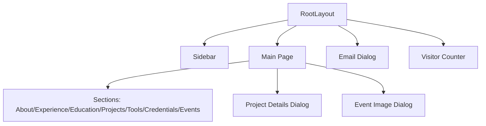

# Architecture

This document explains the current architecture of the portfolio so a UI redesign can be planned without breaking behavior.

## Overview
- Framework: Next.js (App Router) with React and TypeScript.
- UI: Tailwind CSS with shadcn/ui primitives in `components/ui`.
- Runtime: Mostly client-side UI with lightweight state in the main page.
- Assets: Static images and icons in `public/`.
- External: Visitor count via `countapi.xyz`.

## High-Level Structure
- `app/layout.tsx` defines global layout, fonts, and shared UI (sidebar, email dialog, visitor counter).
- `app/page.tsx` is a single-page, client-rendered portfolio with section anchors.
- `components/` holds interactive UI elements (sidebar, dialogs, counters).
- `components/ui/` contains shadcn/ui primitives used throughout.
- `public/` stores project images, event photos, icons, and badges.

## Rendering Model
- The home page is a client component (`"use client"`) and owns most UI state.
- Sections are rendered in one page and navigated by scrolling to anchors.
- Dialogs are conditionally rendered overlays driven by state.

## Core Files and Responsibilities
- `app/layout.tsx`
	- Loads Product Sans font.
	- Applies global layout structure.
	- Renders `Sidebar`, `EmailDialog`, `VisitorCounter`.
- `app/page.tsx`
	- Controls intro animation and main content visibility.
	- Owns all section data arrays (experience, projects, tools, events, etc.).
	- Manages carousel state for Projects and Events.
	- Drives dialogs for project and event details.
- `components/Sidebar.tsx`
	- Sticky sidebar with section navigation and social links.
	- Mobile menu overlay and scroll-spy behavior.
- `components/ProjectDetailsDialog.tsx`
	- Full-screen overlay for project details.
- `components/EventImageDialog.tsx`
	- Carousel-style overlay for event photo viewing.
- `components/EmailDialog.tsx`
	- Floating button and modal that launches a `mailto:` link.
- `components/VisitorCounter.tsx`
	- Fetches and displays visitor count from CountAPI.

## Data Placement
- All portfolio content is currently hard-coded inside `app/page.tsx`.
- There is no CMS or API layer in this version.
- Images and icons are loaded by path from `public/`.

## Styling and Theming
- Tailwind is the primary styling system via `app/globals.css`.
- CSS variables define theme tokens, with `.dark` applied on the `body`.
- Custom animations are defined in `globals.css` (gradient, fade-in, etc.).

## UI Patterns and Behaviors
- **Intro sequence:** timed text transitions before main content is shown.
- **Anchor navigation:** `Sidebar` scrolls to `id` sections and tracks active section.
- **Carousels:** simple translateX track controlled by `activeProjectIndex` and `activeEventIndex`.
- **Dialogs:** conditional render of overlay components; click outside to close.

## External Dependencies and APIs
- `countapi.xyz` is used for visitor tracking. It is called client-side on mount.
- `lucide-react` provides icons.

## Redesign Notes (Non-Functional Guidance)
- Keep section `id`s stable if you want to preserve anchor navigation.
- Keep image paths under `public/` to avoid code changes during layout redesign.
- If you split `app/page.tsx`, maintain data shape for dialogs and carousels.
- Consider moving data to JSON or a CMS if you want content editing without code changes.
